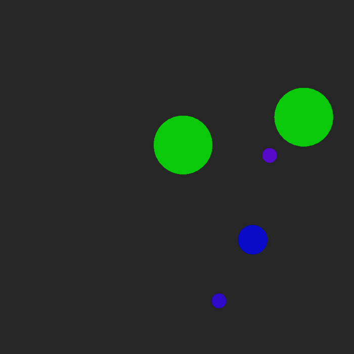
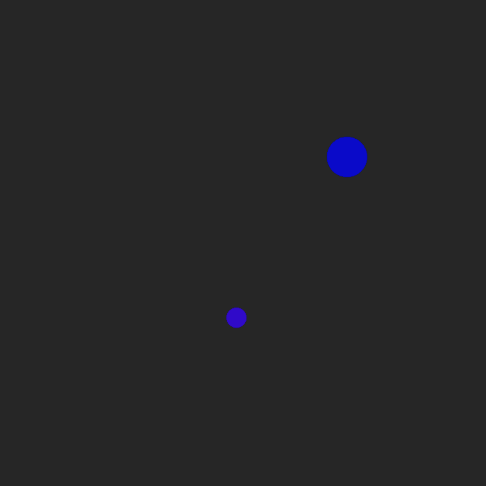
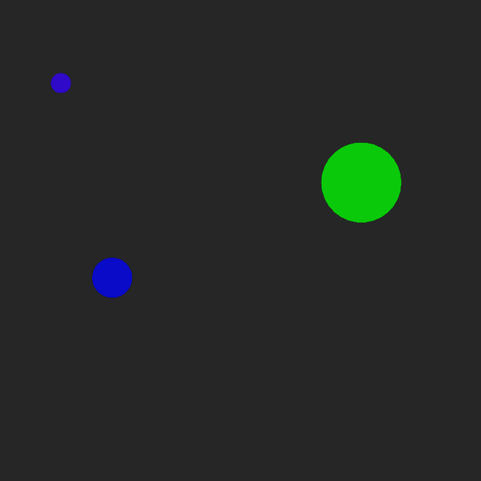
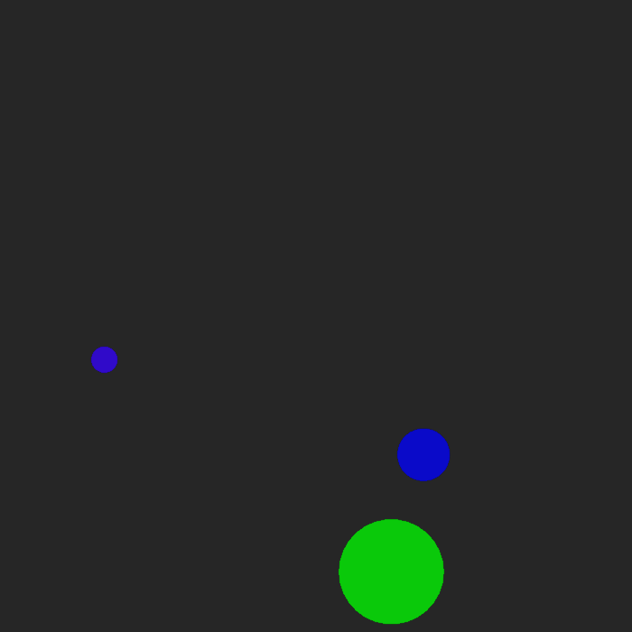
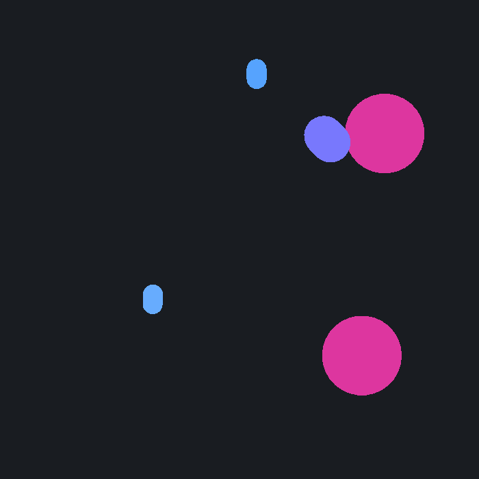
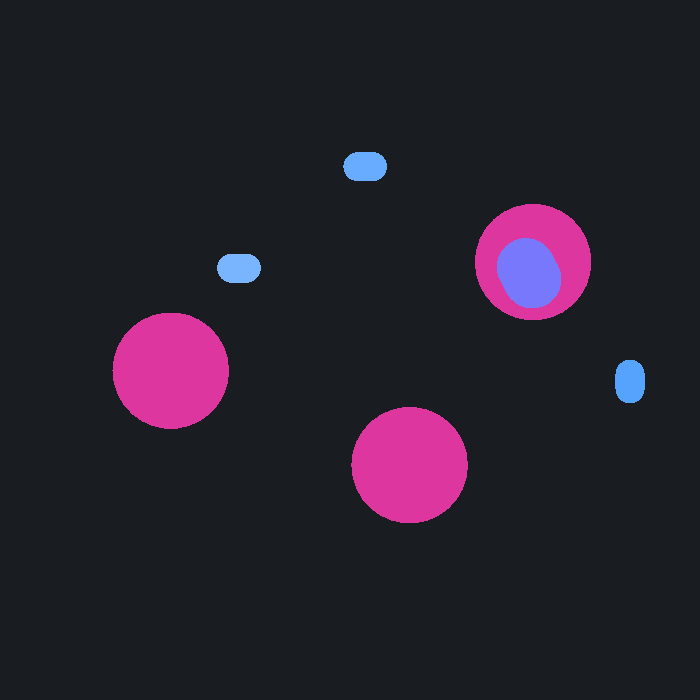
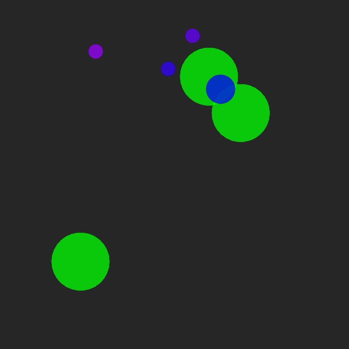
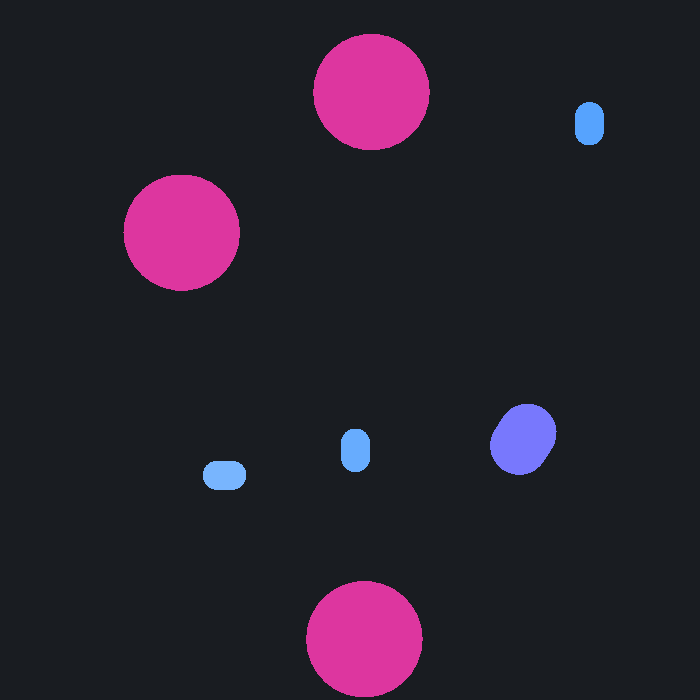
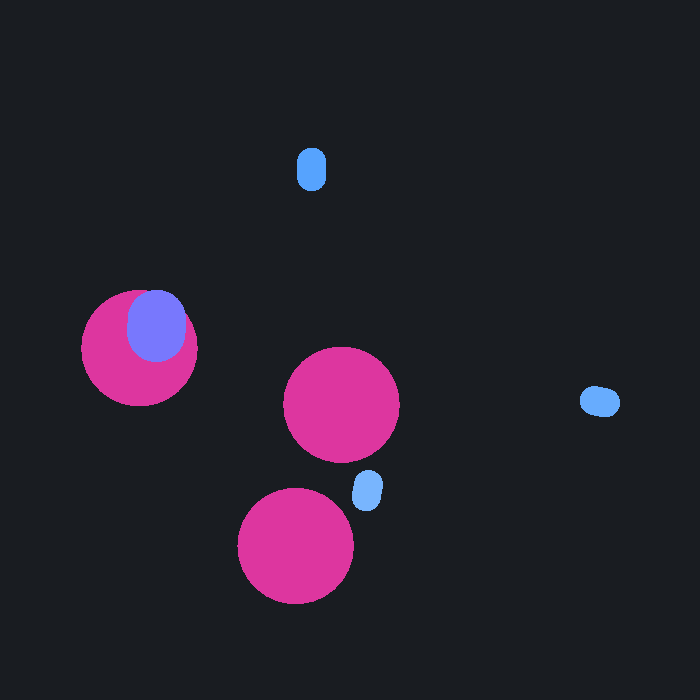

# Multi-Agent Reinforcement Learning Experiment 



Welcome to the **multi-agent-maddpg-sandbox** project. This repository contains an experiment focused on Multi-Agent Reinforcement Learning (MARL). Specifically, it utilizes the Multi-Agent Deep Deterministic Policy Gradient (MADDPG) algorithm to train multiple agents in a custom particle-based sandbox environment.

## Overview

This project aims to demonstrate and evaluate the coordination, cooperation, or competition between multiple agents using MARL techniques. It is built upon the foundational concepts from the paper: [Multi-Agent Actor-Critic for Mixed Cooperative-Competitive Environments](https://arxiv.org/pdf/1706.02275.pdf).

## Experiment Results

Over the course of 10 incremental experiments, the observation spaces, reward formulations, and agent behaviors were progressively refined to train a cooperative swarm of agents tracking a leader moving in a circle, avoiding collisions and adapting to active/inactive landmarks.

| Exp. | Description / Objective | Observation Space Improvements | Reward Formulation | Training Length | Accumulated Reward | Visual Behavior |
| :--- | :--- | :--- | :--- | :--- | :--- | :--- |
| **1** | Single follower tracking a circular leader | Target relative position ($dx, dy$) | Logarithmic distance: $-\ln(d)$ | 5k episodes | 242.9 |  |
| **2** | Follower learning smooth matching | Target $dx, dy$ + follower velocity | Logarithmic distance: $-\ln(d)$ | 5k episodes | 311.5 |  |
| **3** | Single follower + 1 active/inactive goal | Same + goal $dx, dy, state$ | Logarithmic distance to target/goal | 5k episodes | 157.4 |  |
| **4** | Single follower + leader future position estimation | Same as Exp. 3 | Logarithmic distance to estimated future position | 5k episodes | 146.1 |  |
| **5** | Chain of 2 followers + 2 active/inactive goals | Same as Exp. 3 | Same as Exp. 3 | 25k episodes | 397.5 |  |
| **6** | Chain of 2 followers + velocity alignment reward | Target $dx, dy$ + goal info + velocity differences | Weighted: $0.7 \cdot \text{distance}$ + $0.3 \cdot \text{cos-sim}(v_{\text{agent}}, v_{\text{target}})$ | 10k episodes | 301.1 |  |
| **7** | Chain of 3 followers + 3 goals + chain velocity alignment | Same as Exp. 6 | Same as Exp. 6 | 20k episodes | 541.4 |  |
| **8** | Chain of 3 followers + 3 goals + shared active goal + random leader speed | Same as Exp. 6 | Same as Exp. 6 | 100k episodes | 494.4 |  |
| **9** | Chain of 3 followers + 3 goals + Bounded Exponential Decay rewards | Same as Exp. 6 | Same as Exp. 6 with Bounded Exponential Decay: $e^{-d/\sigma_d}$ | 100k episodes | 166.0 |  |
| **10** | Chain of 3 followers + 3 goals + mutual agent collision awareness | Same as Exp. 6 + other agents pos/vel | Same as Exp. 6 with Bounded Exponential Decay | 100k episodes | 167.3 |  |

### Takeaways
1. **Follower Self-Velocity (Exp 1 vs. 2):** Including the follower's own velocity in the observation space directly improved tracking quality, increasing the accumulated reward from 242.9 to 311.5 by allowing the agent to perform smoother velocity matching.
2. **Goal vs. Leader Task Switching (Exp 2 vs. 3):** Introducing a dynamic landmark goal caused the accumulated reward to drop from 311.5 to 157.4. Despite the lower numerical reward, the follower successfully learned the correct conditional behavior: prioritizing the goal when active and returning to track the leader otherwise.
3. **Predictive Tracking (Exp 3 vs. 4):** Attempting to estimate the future position of the leader using its velocity vector to counteract lag did not improve the accumulated reward (dropping from 157.4 to 146.1), showing that direct relative tracking was more stable for this configuration.
4. **Multi-Agent Scaling & Training Time (Exp 3 vs. 5):** Increasing the chain length to 2 followers (with 2 goals) yielded an accumulated reward of 397.5. On a per-follower basis, the average reward rose from 157.4 to 198.75 ($397.5 / 2$), demonstrating that the longer training time ($25\text{k}$ episodes vs. $5\text{k}$ episodes) successfully enabled the multi-agent chain to coordinate and track more effectively on average.
5. **Velocity Alignment Reward (Exp 5 vs. 6):** Introducing the velocity alignment objective (weighted at 30% of the reward) limited the drop in accumulated reward (397.5 to 301.1) despite having a much shorter training duration ($10\text{k}$ episodes vs. $25\text{k}$ episodes). This suggests that the explicit velocity matching signal provided a cleaner gradient path for coordination.
6. **Cooperative Scaling (Exp 6 vs. 7):** When scaling the chain from 2 to 3 followers (and 2 to 3 goals), the average reward per agent remained stable and high at around 150–180 ($301.1 / 2$ vs. $541.4 / 3$). This shows that the coordination policy scales successfully to longer chains without degrading individual agent tracking performance.
7. **Shared Landmark Bottleneck (Exp 7 vs. 8):** In Exp 8, all 3 followers were trained to target the same shared active goal. This significantly increased the risk of collision and crowding at the single target. As a result, despite 5x more training ($100\text{k}$ episodes vs. $20\text{k}$ episodes), the accumulated reward dropped from 541.4 to 494.4, illustrating the difficulty of coordinating around a single spatial bottleneck.
8. **Logarithmic vs. Exponential Decay Rewards (Exp 8 vs. 9):** Logarithmic rewards ($-\ln(d)$) are unbounded and tend to $+\infty$ as $d \to 0$, which mathematically incentivizes agents to overlap completely with their targets, exacerbating collisions. Bounded exponential decay rewards ($e^{-d/\sigma_d}$) cap the reward at $1.0$, removing this infinite overlap incentive and theoretically allowing collision avoidance to be learned. However, without explicit collision avoidance mechanics in Exp 9, frequent collisions still occurred in practice.
9. **Mutual Agent Awareness (Exp 9 vs. 10):** Adding the relative positions and velocities of neighboring agents directly into the observation space was expected to help the swarm coordinate and reduce collisions. However, it achieved nearly identical reward levels (167.3 vs. 166.0) and did not improve collision avoidance in practice, highlighting that exposing neighbor states is insufficient without explicit collision penalties in the reward function.

## Project Structure

The project code is divided into two main sub-directories:

*   **`code/maddpg/`**: Contains the core implementation of the MADDPG algorithm, replay buffers, and the training scripts (e.g., `experiments/train.py`).
*   **`code/multiagent-particle-envs/`**: Contains the Multi-Agent Particle Environments (MPE). This includes the physics engine, rendering, and definitions of various scenarios. Custom scenarios (like `circle_sandbox`) are defined in `code/multiagent-particle-envs/multiagent/scenarios/`.

## Prerequisites

Before starting, ensure you have the following installed:

*   [uv](https://github.com/astral-sh/uv) (for environment and dependency management)

## Installation & Setup

Follow these steps to set up the project:

1.  **Clone the repository** and navigate to the project root directory.
2.  **Sync the environment** using `uv`. This will automatically download the correct Python version (3.9) and install all dependencies (including native macOS Apple Silicon compatibility for TensorFlow and setting up the subprojects in editable mode):

    ```bash
    uv sync
    ```

## How It Works

The environment consists of a continuous observation and discrete action space where agents interact based on basic simulated physics.
1.  **Environment Generation:** The `multiagent-particle-envs` directory defines the world, including agents, landmarks, and rules of the specific scenario.
2.  **Training:** The `train.py` script initializes the environment and the MADDPG trainer. During training, agents explore the environment, collect experiences, and update their policies to maximize their rewards over time.
3.  **Evaluation:** Once trained, the saved models can be loaded to visually evaluate the agents' learned behaviors without further training.


## Usage

### 1. Training

To start training the agents (e.g. on scenario 9), run the following command. The models and training states will be saved in the `./test_circle_sandbox_9/` directory.

> [!NOTE]
> We set the environment variable `KERAS_HOME=./.keras` to redirect cache files to a writable workspace directory to avoid sandbox/permission warnings.

```bash
KERAS_HOME=./.keras uv run python code/maddpg/experiments/train.py --scenario circle_sandbox_9 --max-episode-len 80 --num-episodes 5000 --save-rate 200 --save-dir ./test_circle_sandbox_9/
```

The script `scripts/record_scenarios.py` permits to run train all the experiments (then export videos and gifs) for the scenarios defined in the inner config:

```python
# Scenario configs: (scenario_id, episodes)
SCENARIOS = [
    (1, 5000),
    (2, 5000),
    (3, 5000),
    (4, 5000),
    (5, 25000),
    (6, 10000),
    (7, 20000),
    (8, 100000),
    (9, 100000),
    (10, 100000),
]
```

To run it: 

```bash
uv run python scripts/record_scenarios.py
```

### 2. Evaluation

To evaluate the trained agents and display their behavior visually, use the `--display` flag and point to the directory where the model was saved:

```bash
KERAS_HOME=./.keras uv run python code/maddpg/experiments/train.py --scenario circle_sandbox_9 --load-dir ./test_circle_sandbox_9/ --display
```

You can monitor the training progress of all scenarios side-by-side using TensorBoard. Since pointing TensorBoard directly to `./` would scan the entire virtual environment (`.venv/`) and take a long time, we provide a helper script that targets only the active scenario training log directories:

```bash
uv run python scripts/launch_tensorboard.py
```
*(Once running, open the provided localhost link in your web browser to view the dashboard).*

If you want to specify a custom port (e.g. `6001`), you can pass standard TensorBoard flags:
```bash
uv run python scripts/launch_tensorboard.py --port 6001
```

### 4. Additional Information

For a full list of command-line options available for training and environment configuration, you can use the help flag:

```bash
uv run python code/maddpg/experiments/train.py --help
```

*Note: New scenario scripts should be defined in the `code/multiagent-particle-envs/multiagent/scenarios/` directory.*
