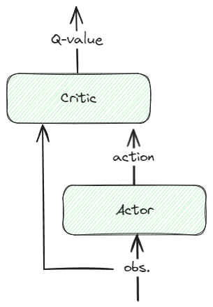

<style scoped>
section {
  font-size: 40px;
}
</style>

# Multi-agents experiments
Based on MADDPG

---
# MADDPG
**Multi-Agent Deep Determininistic Policy Gradient** [1]


- Challenge: multi-agent environment are **non stationnary**
- MADDPG proposes **centralized** training but **decentralized** execution
- Extends other Actor-Critic Policy Gradient Methods (eg: DDPG[2]): shared repay buffer for Critics
- Like DDPG, made for **continous control**
- For each agent: 2 networks: **Actor** and **Critic** (in a *running* and *target* versions)

```
[1] "Multi-Agent Actor-Critic for Mixed Cooperative-Competitive Environments", R. Lowe et al, 2017.
[2] "Continuous Control With Deep RL", T. Lillicrap et al, 2015.
```
---


- **Centralized training**:
  - Critic $Q(o, a)\rightarrow v$, for an observation $o$ (a state) and an action $a$, give a value $v$ used to train the Actor net.
  - Critics **share** their information during **training**.
  - *"How good is an action given that state?"*

---


- **Decentralized execution**:
  - Actor $\pi(o)\rightarrow a$, for an observation $o$, gives an action $a$
  - Trained of the Critic 
  - Actors use **only local** information at **exec. time**
  - *"What the best action given that state?"*

<!-- # TODO:
- non stationnary
- Q-value
- running vs target
- p_loss vs q_loss -->
---
## Experiments


<!-- - 1 Table
- capture de metriques
- Ex de code
- What went well/wrong
- CC/next steps -->
---
### Summary
<!-- Scoped style -->
<style scoped>
{
  font-size: 22px
}
table > thead:has(> tr > th:empty):not(:has(> tr > th:not(:empty))) {
  display: none;
}

</style>

| Exp.| Desc.                                  | Obs.                   | Reward        | Acc.R. |
| --- | -------------------------------------- | ---------------------  | ------------- | ---- |
| 1   | Single agent follows a leader          | dx, dy                 | dist(leader)  | 240  |
| 2   | Single agent follows a leader          | dx, dy, **agent_vel_x/y** | idem       | 310  |  
| 3   | 2 agents and a landmark (lk)           | idem, **lk_dx/dy, lk_is_active** | dist(lk or leader) | 160 |
| 4   | 2 agents and a landmark + separation   | idem                   | dist(leader_pos - 4 * leader_vel) | 150 |
| 5   | 3 agents and 2 landmarks (no sep) 10k it.| idem, **target_vel_x/y** | dist(lk or target) | 410 |
| 6   | 3 agents and 2 landmarks (with alignment) 10k it.|  idem        | .7 * dist + **.3 * cos_sim(d_vel)** | 300 |
| 7   | 4 agents and 3 landmarks (with align) 25k it.    | idem         | idem          | 540 |
| 8   | idem + separation and alignment (WIP)  | idem - **agent/target vel** + **d_vel angle and mag** | idem | 395 |

| <!-- -->                            | <!-- -->                           | <!-- -->                           |
|-------------------------------------|------------------------------------|------------------------------------|
|**target**: leader or previous agent | **dx, dy**: target_pos - agent_pos | **d_vel**: agent_vel - target_vel
 
---
### **Observations** example (Exp. 8)
```python
target_id = agent.id-1

# target distance
target = self.find_agent_by_id(world, target_id)
if target:
    self.fix_agent_vel(target)
    # delta x/y
    d_pos = target.state.p_pos - agent.state.p_pos
    # delta vel
    dv_angle, dv_mag = self.get_angle(target.state.p_vel, agent.state.p_vel)
    
# agent's goal
lm = self.find_entity_by_name(world, f"Goal {target_id}")
if lm:
    lm_d_pos = lm.state.p_pos - agent.state.p_pos
    lm_act = int(lm.activate == True)

return np.array([d_pos[0], d_pos[1], dv_angle, dv_mag, lm_d_pos[0], lm_d_pos[1], lm_act])
```
---
### **Rewards** example (Exp. 8)

```python
target_id = agent.id-1
target = self.find_agent_by_id(world, target_id)

# if the goal is activated, try to get it
landmark = self.find_entity_by_name(world, f"Goal {target_id}")
if landmark and landmark.activate:
    d = dist(agent.state.p_pos, landmark.state.p_pos)
    reward = -math.log(d)

# else follow the leader
else:
    target_pos = self.estimate_target_pos(agent, target)
    d = dist(agent.state.p_pos, target_pos)
    angle, mag = self.get_angle(target.state.p_vel, agent.state.p_vel)
    reward = .7 * -math.log(d) + .15 * -math.log(abs(angle)) + .15 * -math.log(mag)
return reward
```
---
# How does it **learn**?


- No landmark VS landmark (exp2 vs exp3): ↘️
- Separation (exp4 vs exp5): ↘️
- Single vs multi-agents (exp3 vs exp5): 🐌
- All constraints: 🚀 convergence time and unstability
---
# What went well/wrong

- ⚠️ Setup on MacOS
- ⚠️ Fix some "bugs" (no blinking landmarks)
- ⚠️ Hard to find a good multi-objective reward (distance + separation + alignment)
- ✅ Setup dev. env using VSCode
- ✅ Time management: family time during WE, work, sport, etc.
- ✅ Discovered new algo, multi-agent RL and a new GYM plateform!

---

# Next steps


- Finish separation and alignment (5 functions so far)
- Better reward activation: 
  - $-log(x)$,
  - $1/x$,
  - sigmoid(x),
  - $-x * .5 + 1$, etc
- Obstacles, ...
- Longer trainings, ...

---
# **Thank you!**
